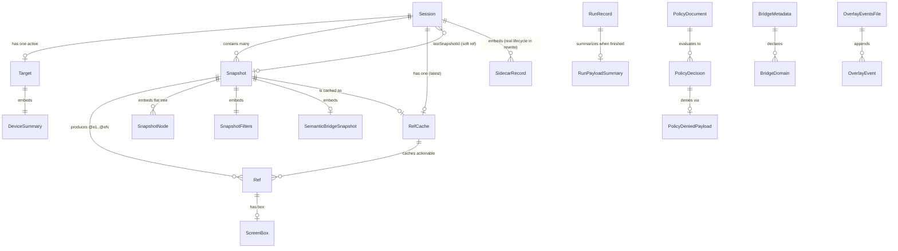

# expo98 — AI-Native Specification (reimagine source-of-truth)

*Consolidated 2026-05-24 by `/modernize-reimagine expo98 "<Effect-TS rewrite>"` (Phase A).*
*The legacy `src/**` (HEAD `77fc1a6`) is the **specification source**, not a port target.*
*This file is the spec the greenfield Effect-TS build implements against. It consolidates — and does not replace — the deeper artifacts it cites:*

| Artifact | Role |
|---|---|
| `reimagine/rules-gwt.md` | the 58 Given/When/Then acceptance criteria (**the behavior contract / acceptance tests**) |
| `reimagine/interfaces.md` | full inbound/outbound interface catalog |
| `reimagine/entities.md` | full domain/entity model + aggregate boundaries |
| `BUSINESS_RULES.md` | RULE-001..058 with line-cited source evidence |
| `DATA_OBJECTS.md` | DTO field types + persistence map |
| `ASSESSMENT.md` | inventory, debt, security findings, COCOMO |
| `MODERNIZATION_BRIEF.md` | approved target stack, 5-phase plan, **18 resolved open questions** |

> **Provenance note.** Phase A spec-mining was already complete and consolidated in `reimagine/*` against the current HEAD; the four FIX-driving structural claims (no centralized gate; `trace` ungated; weak generic redactor; 75/79 command count) were re-verified live on 2026-05-24 before this consolidation. No re-mining was performed because the source tree is unchanged.

---

## 0. What expo98 is (one paragraph)

A **local-first evidence CLI for Expo / React Native iOS work**. It inspects a running app over the Chrome DevTools Protocol (Hermes, via WebSocket), drives the iOS simulator through `xcrun`/`simctl` (and `axe`/`idb`/`adb`/`open` where present), probes Metro over loopback HTTP, and captures **redacted, reproducible evidence** (snapshots, screenshots, HARs, run records). It is interactive and per-invocation — **no database, no hosted service, no batch SLA**. Two promises are load-bearing: **fail-closed** (state-changing actions are denied unless an explicit policy allows the exact action) and **redact** (no secret leaves the process — stdout, stderr, persisted records, HAR, summaries).

---

## 1. Capabilities (what the system must do)

Derived from the 58 rules + the 75-command inbound surface. Grouped by capability, each tagged with the acceptance criteria (AC) that define "done". Default priority is the rule's own; **P0 = the 10 invariants that may never regress** (§5).

### C1 — Safety spine (the reason the tool exists) · **P0**
- **C1.1 Fail-closed gate** — classify every action's side-effect (`read` / `device` / `runtime-eval`), deny non-reads unless policy/flag/token allows; unknown action ⇒ `device`. *(AC-001, AC-002, AC-005, AC-006, AC-007)*
- **C1.2 Single redactor at the output boundary** — one strongest-superset redactor runs on every payload before stdout or disk. *(AC-003, AC-012)*
- **C1.3 Runtime-eval is gated** — injected-JS paths (`wait --fn`, `trace`, mutating `inspector`) require policy or `--allow-runtime-eval`. *(AC-004, AC-010 FIX, AC-011 FIX)*
- **C1.4 Loopback-only networking** — CDP WS and Metro probes only ever talk to `127.0.0.1|localhost|[::1]|::1`. *(AC-021, AC-030 FIX)*
- **C1.5 Artifact-path confinement** — `--output-path` (HAR/screenshot/recording) must resolve under the artifacts root; reject `../`/absolute. *(AC-013 FIX)*
- **C1.6 Run-record integrity** — persisting a run record is observational and may never change a command's exit code. *(AC-025 FIX)*
- **C1.7 Confirmation tokens for source-writing actions** — bridge install/remove and overlay scaffold gate behind `--confirm-actions` tokens. *(AC-008)*

### C2 — Stable machine output contract (the agent/POSIX surface)
- `--json` → `{ ok:true, data }` | `{ ok:false, error }`; `--plain` → stable line output; the two are mutually exclusive (else exit 2). `available:false`+`code`+`reason` for designed-unavailable evidence (exit 0). Exit codes `0/1/2`. Value flags require a value (exit 2). Output truncated at one canonical budget with one overflow marker. *(AC-015, AC-016, AC-041)*
- **New for the rewrite:** NDJSON **streaming progress** channel for long-running evidence commands (still redacted/truncated; final payload still capped). `--no-input` never-prompt guarantee. `--content-boundaries` untrusted-output wrapping.

### C3 — Discovery & project introspection (read-only)
- Doctor/capability checks, dependency + Expo↔RN compatibility classification, Expo Router sitemap normalization, device listing, Expo/RN module + component-tree introspection. *(AC-020, AC-044, AC-055)*

### C4 — Evidence sessions (the stateful spine)
- Session lifecycle (`new→close→clean`) owning an artifact namespace; stable device/app/Metro **target** identity with staleness on rediscovery; **snapshot** capture (semantic-bridge → native `axe` fallback) persisting addressable refs `@e1..@eN`; ref/get/find/wait over the latest snapshot. *(AC-017, AC-018, AC-019, AC-024, AC-026, AC-035, AC-036)*

### C5 — App & simulator lifecycle (gated device mutations)
- boot / open-url / launch / terminate / reload / install / uninstall / open-route / set-environment, each policy-gated; launch/reload attach crash evidence and fail closed on a post-launch crash within a non-zero grace window. *(AC-005, AC-029, AC-056 FIX)*

### C6 — Interaction & gestures (gated device mutations)
- tap / gesture / ref-actions / keyboard / clipboard / screenshot, with signed-delta scroll/gesture plans, element-center targeting, and scroll-and-stitch full-page screenshots. *(AC-036, AC-037, AC-054)*

### C7 — In-app devtools bridge (dev-only, token+policy gated)
- Install/remove a dev-only bridge; report install state (absent/present/stale/incompatible) and a real runtime-health state machine; gated storage/state/controls domain actions with redacted, size-bounded returns. *(AC-006, AC-008, AC-009, AC-027, AC-028 build-out)*

### C8 — Runtime & DevTools evidence
- DevTools capabilities, bounded console/errors, navigation state (read) + nav mutations (gated), inspect/highlight, dev-menu, and the (now-gated) `trace`/`inspector`. *(AC-007, AC-010, AC-011, AC-039)*

### C9 — Network & performance evidence
- Metadata-only network waterfall + duplicates + redacted HAR + derived `ok`; perf summary/interaction/report/compare/budget/memgraph with fixed thresholds, direction-aware comparison, confidence rollup, and native `sample`/Instruments parsing. *(AC-022, AC-045, AC-046, AC-047, AC-048, AC-049 FIX, AC-050, AC-051, AC-052)*

### C10 — Artifacts, review, observability & orchestration
- record/diff/ux-context/annotate/review-overlay (+ hardened loopback HTTP server)/review-next/review/dashboard; **batch** fan-out (serial, bail-on-first-failure, exit-code-isolated) and **live-backlog** (source-derived command matrix, project-config inputs not baked fixtures). *(AC-014 FIX, AC-031, AC-032, AC-057, AC-058 FIX)*

### Capability priority rollup
- **P0 (10):** the C1 safety-spine invariants → AC-001/002/003/005/006/007/010/011/012/013 (+ supporting AC-021/025/030).
- **P1 (26) / P2 (22):** C3–C10 functional behaviors. Full mapping in `rules-gwt.md`.

---

## 2. Domain Model

No database. Durable state is JSON under a per-invocation **state root** (default `<cwd>/.scratch/expo98`); `BridgeMetadata` is the one project-scoped exception (`<projectRoot>/.expo98/`). Target shape for the rewrite: **Effect `Schema` tagged structs**. Full field tables in `reimagine/entities.md` / `DATA_OBJECTS.md`.

**Four independent aggregates** (cross-links by ID only):
1. **Session** (root) — owns its active **Target**, all **Snapshots**, the latest **RefCache**, and embedded value objects (Ref, ScreenBox, SnapshotNode, SnapshotFilters, SemanticBridgeSnapshot, DeviceSummary, SidecarRecord). Invariants: `activeTargetId`→`target.json`, `lastSnapshotId`→an existing snapshot, `refs.json` mirrors `lastSnapshotId`.
2. **RunRecord** — `running→completed|failed` audit of one invocation, keyed `<stateDir>/<runId>.json`, decoupled from sessions; write is observational.
3. **BridgeMetadata** — project-scoped install marker + declared domains.
4. **OverlayEventsFile** — append-only review-overlay event log.

Non-persisted values (per-invocation, redacted at the boundary): `PolicyDocument`, `PolicyDecision`, `PolicyDeniedPayload`, `CliGlobals`, and all command result envelopes (`NetworkEvidencePayload`, `PerfReport`, `WaitEvaluation`, `TargetCurrentResult`, `GesturePlan`, `crashCheck`, `BridgeInstallStatus`, `LiveBacklogSummary`, …).



**Schema-drift to resolve in the rewrite:** unify the 3 `SessionRecord` declarations on the strict variant (with `closedAt?`, typed `sidecars`); type `semanticBridge` (currently `unknown`); give `OverlayEventsFile.events` and `BridgeMetadata.domains` element schemas.

---

## 3. Interface Contracts

expo98 is an **interactive local CLI** — "frequency" is per-invocation; latency is bounded by simulator/Metro/Hermes round-trips, not throughput. Full catalog in `reimagine/interfaces.md`.

### 3.1 Inbound — the two bins + global flags
- Bins: `expo98` (primary) and `expo-ios` (pure re-export, no behavioral fork). Node ≥20.19.0 ESM, shebang `#!/usr/bin/env node`. Both names **preserved** in the rewrite.
- Global flags (every command): `--json`, `--plain` (mutually exclusive→2), `--quiet`, `--root <dir>`, `--state-dir <dir>` *(legacy `runs`-parent quirk DROPPED — treated literally)*, `--action-policy <path>`, `--max-output <chars>`, `--allow-runtime-eval <bool>`, `--confirm-actions <list>`, `--record`, `--content-boundaries`, `--debug`, `--no-color`, `--no-input`, `--version`, `--help/-h`.
- Exit: `0` success · `1` runtime_failure · `2` invalid_usage.

### 3.2 Inbound — CLI command API (OpenAPI-style fragment)

```yaml
# Each command is an operation; "side-effect" is the policy class that gates it.
openapi-ish: expo98-cli
operations:
  # --- reads (ungated) ---
  doctor: { sideEffect: read, out: DoctorRecord }
  project-info: { sideEffect: read, args: [--cwd], out: DependencyInfo|CompatibilityClassification }
  routes: { sideEffect: read, args: [--cwd], out: RouteEntry[] }
  devices: { sideEffect: read, out: DeviceList }
  session: { sideEffect: read, verbs: [new,list,show,close,clean], out: SessionRecord }
  target: { sideEffect: read, verbs: [list,select,current], out: TargetCurrentResult }
  snapshot: { sideEffect: read, args: [--interactive,--depth,--bounds], out: SnapshotResult }
  refs|get|find: { sideEffect: read, out: RefRecord[] }
  wait: { sideEffect: read, "wait.fn": runtime-eval, out: WaitEvaluation }
  metro: { sideEffect: read, verb: status, out: MetroStatusPayload }
  console|errors: { sideEffect: read, args: [--limit], out: BoundedList }
  network: { sideEffect: read, verbs: [requests,waterfall,har], out: NetworkEvidencePayload }
  perf: { sideEffect: read, verbs: [summary,interaction,report,compare,budget,memgraph], out: PerfReport }
  policy: { sideEffect: read, verbs: [show,check], out: PolicyDecision }
  redact: { sideEffect: read, args: [<file>,--output-path], out: RedactedFile }
  # --- device mutations (policy-gated) ---
  boot-simulator|open-url|launch-app|terminate-app|reload-app|install-app|uninstall-app|open-route|set:
    { sideEffect: device, gate: policy, denial: PolicyDeniedPayload, sideEffectOnDeny: none }
  tap|gesture|ref-actions(*11)|keyboard|clipboard: { sideEffect: device, gate: policy }
  navigation: { state: read, "back|pop-to-root|tab|deep-link": device }
  storage|state|controls: { read-verbs: read, mutate-verbs: device, return: redacted+bounded }
  # --- runtime-eval (gated; FIX for trace/inspector) ---
  trace: { sideEffect: runtime-eval, gate: policy|--allow-runtime-eval }   # FIX AC-010
  inspector: { mutate-verbs: runtime-eval, read-verbs: read }              # FIX AC-011
  # --- source-writing (token+policy) ---
  bridge: { verbs: [plan,status,health,domains], install|remove: confirm-token, out: BridgeInstallStatus }
  review-overlay: { scaffold: confirm-token, server: loopback-http, out: OverlayEventsFile }  # FIX AC-008
  # --- fan-out (in-process fibers in rewrite) ---
  batch: { sideEffect: read, semantics: serial+bail, exitCodeIsolated: true, out: BatchResult }
  live-backlog: { verbs: [generate,matrix,run], inputs: project-config, out: LiveBacklogSummary }
envelope:
  success(--json):  { ok: true, data: <PayloadDTO> }     # redacted + truncated
  failure(--json):  { ok: false, error: <string> }        # exit 1|2
  designedUnavailable: { available: false, code, reason }  # exit 0
  streaming(--ndjson): "<one redacted JSON event per line; final payload still capped>"  # NEW
```
*(Full 75-command table with output DTOs per command in `reimagine/interfaces.md §1.3`.)*

### 3.3 Inbound — overlay HTTP server (AsyncAPI/OpenAPI fragment)

```yaml
servers: { local: { url: http://127.0.0.1:{port}, defaultPort: 17655 (search up on EADDRINUSE), bind: loopback-only } }
paths:
  /events.json:
    get: { 200: application/json -> OverlayEventsFile }   # {version:1,title,createdAt,updatedAt?,events[]}
  "{endpointPath}":   # default /events, pattern ^/[A-Za-z0-9_./-]+$
    post:
      # REWRITE CONTRACT (FIX AC-014): require unguessable per-session token + strict Origin check
      #                                 + hard body-size cap + comments[] schema validation
      requestBody: application/json (validated comments[] schema)
      responses: { 200: { ok:true, eventsPath, eventCount }, 401|403: token/Origin reject, 404: not-found, 413: body too large }
```
*This is the only inbound network listener (`annotation-server` is a dead tombstone; `dashboard` does not listen).*

### 3.4 Outbound — integration contracts

```yaml
hermes-cdp:   # @effect/platform Socket (ws dropped)
  transport: WebSocket to webSocketDebuggerUrl (from Metro /json/list)
  sequence: Runtime.enable -> Runtime.evaluate {returnByValue:true, awaitPromise:true}
  correlation: incrementing id ; header Origin: http://127.0.0.1[:port] ; open <= min(timeoutMs,2500)ms
  safety: LOOPBACK-ENFORCED on the WS target (FIX AC-030) ; ALL runtime-eval through the central gate
metro-http:   # @effect/platform HttpClient ; loopback-only
  endpoints: GET /status, /json/list, /json/version ; POST /symbolicate
  rules: never auto-start Metro ; non-array /json/list -> malformedTargets ; skip rows w/o identity ; port clamp 1..65535
subprocess:   # @effect/platform Command ; execFile argv arrays (NO shell)
  binaries: xcrun/simctl, open, axe, idb, adb, node/npx/plutil
  rewrite: replace the 2 `sh -lc` probes with shell-free PATH lookup ; ONE wrapper w/ per-call timeout+maxBuffer+typed tool-not-found
filesystem:   # @effect/platform FileSystem
  stateRoot: --state-dir | <--root|cwd>/.scratch/expo98
  writes: sessions/<id>/{session,target,refs}.json, snapshots/<sid>.json ; <stateDir>/<runId>.json (best-effort) ;
          <projectRoot>/.expo98/bridge.json + bridge source (token-gated) ; <overlayDir>/events.json
  artifacts: <outputPath> for HAR/PNG/memgraph/recording -> CONFINED under artifacts root (FIX AC-013)
  contract: preserve directory layout + DTO schemas so existing artifacts stay readable
expo-integration:  # NEW — official Expo plugin SDK + @expo/config-plugins
  use: config/router/module introspection + in-app devtools bridge via the OFFICIAL Expo DevTools plugin path
  data: Expo->RN compatibility map moves to a data file / fetched manifest (no code release to update)
```

---

## 4. Non-Functional Requirements (inferred from legacy)

| NFR | Requirement | Source / rationale |
|---|---|---|
| **Workload shape** | Interactive, per-invocation; **no batch window, no throughput SLA, no p50/p95 corpus**. Tail latency = simulator/Metro/Hermes round-trips. | ASSESSMENT "Production Runtime Profile" (no telemetry; not a hosted/batch service). |
| **Concurrency** | Single command per process; `batch` fans out **serially** (rewrite: in-process Effect fibers, still ordered, bail-on-first-failure, exit-code-isolated). | AC-031. |
| **Latency bounds** | Every outbound call is time-bounded: CDP open `≤min(timeoutMs,2500)ms`; subprocess timeouts 2.5–120 s per call; WS/Metro per-fetch AbortController. | AC-053, AC-030. |
| **Output bounds** | One canonical payload budget **40,000 chars** + one overflow marker; subprocess `maxBuffer` set **well above** the truncation limit (never clips legitimate output). | AC-041 (resolved Q#8). |
| **Memory safety** | Overlay server hard body-size cap; bridge returns size-bounded (`MAX_OUTPUT=40000`, `MAX_ARRAY_ITEMS=1000`). | AC-014, AC-006. |
| **Determinism** | JSON/plain/snapshot/package output is order-stable; ids collision-resistant + single timestamp format (rewrite). | AC-034 (resolved Q#16). |
| **Portability / POSIX** | Node ≥20.19.0 ESM; exit codes 0/1/2; `--no-input` never prompts; both `expo98`+`expo-ios` bins. POSIX-compliant flag/exit semantics. | §3.1, command vision. |
| **Dependency surface** | Target: **zero non-Effect runtime deps** (`ws` dropped → CDP over `@effect/platform`). Published `files`: `cli/`, `README.md`. | BRIEF Q#9. |
| **Security posture** | Local-only tool; blast radius = operator machine/project. The 6 FIX items (AC-002/003/010/011/013/025 + AC-030) are the security-hardening floor and must be **structural**, not by-convention. | ASSESSMENT security findings. |
| **Supply chain** | `pnpm minimumReleaseAge` delay preserved; pinned versions; argv-only subprocess (no shell ⇒ no CWE-78). | ASSESSMENT. |

---

## 5. Behavior Contract (acceptance tests)

**The 58 Given/When/Then criteria in `reimagine/rules-gwt.md` ARE the acceptance test suite.** Each scaffolded service implements its assigned ACs as executable tests; PRESERVE rules are validated by equivalence vs the legacy bundle, FIX rules by new assertion tests (legacy is wrong there).

### P0 — the 10 invariants that may never regress

| AC | Invariant | Decision |
|---|---|---|
| AC-001 | State-changing actions denied unless policy allows the exact action; reads always pass | PRESERVE |
| AC-002 | ONE side-effect classifier (read/device/runtime-eval); unknown ⇒ device | **FIX** (unify 3 copies) |
| AC-003 | ONE redactor (strongest key superset) at the single output boundary | **FIX** (3 → 1) |
| AC-005 | boot/launch/terminate/reload/install/uninstall gated; denial does zero `xcrun`/`simctl` | PRESERVE |
| AC-006 | storage/state/controls writes gated; return redacted + bounded; defense-in-depth re-check | PRESERVE |
| AC-007 | nav `state` ungated read; back/pop-to-root/tab/deep-link gated | PRESERVE |
| AC-010 | `trace` (injects JS) classified `runtime-eval` and gated | **FIX** (legacy ungated) |
| AC-011 | `inspector` mutating actions gated; reads classified read | **FIX** (legacy gates only open-dev-menu) |
| AC-012 | auth headers / cookies / secret query stripped before network evidence / HAR / route URL leaves | PRESERVE (fold into AC-003) |
| AC-013 | `--output-path` resolves under artifacts root; reject `../`/absolute | **FIX** (legacy unconfined) |

**Promoted into the regression floor (release-gating):** AC-021 (loopback Metro), AC-030 (loopback CDP, FIX), AC-025 (run-record observational, FIX).

### FIX vs PRESERVE summary
- **FIX (intentional divergence — new assertion tests, not equivalence):** AC-002, AC-003, AC-010, AC-011, AC-013, AC-014, AC-025, AC-030, AC-049, AC-056, AC-058 (+ AC-008 consistency, AC-020 data-location, AC-028 build-out, AC-047 exact frame budgets, AC-034 ids).
- **PRESERVE (faithful re-spec — equivalence vs legacy):** everything else, notably AC-001/005/006/007/012 and the calculation rules AC-035–055.

All FIX/build-out decisions were **resolved 2026-05-24** (BRIEF §6, 18 open questions). The HITL P0/drop confirmation for this run is captured in §6 below.

---

## 6. P0 scope & explicit drops (HITL checkpoint #1 — RESOLVED 2026-05-24)

- **P0 capabilities confirmed: Safety spine only (C1).** The 10 invariants (AC-001/002/003/005/006/007/010/011/012/013, + AC-021/025/030 release-gating) are the must-never-regress floor. All C3–C10 functional behavior is P1/P2. Matches the approved BRIEF §4.

- **Deliberate drops (confirmed):**
  1. Legacy `--state-dir` `runs`-parent quirk → `--state-dir` treated literally.
  2. `ws` runtime dependency → CDP over `@effect/platform` sockets (zero non-Effect runtime deps).
  3. Baked live-backlog fixtures (`com.maddie.console`, `exp+maddie://`) → required inputs / project config (AC-058).
  4. Dead `annotation-server` tombstone command.
  5. **Video recording — DROPPED.** The `record` command (`record-artifacts` → `xcrun simctl io recordVideo` → `.mov`) is **not carried forward**. (User: "we don't need to record video.")
  6. **Review-overlay in-app HTML/UI scaffold — DROPPED.** The `review-overlay scaffold` action that generates the `CodexReviewOverlay.tsx` component (`scaffold-template.ts` / `codexReviewOverlayComponentSource`) is **not carried forward**. (User: "the review overlay is needed — not the HTML part.")

- **Kept (explicitly):** the **review-overlay evidence capability** — `prepare` / `server` / `read` / `clear` — including the hardened loopback events server (token + Origin + body-cap + `comments[]` schema, AC-014). Only the in-app HTML/UI component generation is removed.

- **Kept (not dropped):** all other commands + both `expo98`/`expo-ios` bins; `sidecars` is **implemented** (real `running→stale→stopped` lifecycle), not dropped.

- **Open for Phase D review:** `annotate-screen` has the same `scaffold`-writes-`.tsx` pattern as review-overlay. Treated as the **same class as the dropped HTML scaffold** (its `scaffold` action is dropped; `prepare`/`read`/`server` capture kept) unless overridden at the architecture checkpoint.

**Net effect on count:** 75 commands → drop `record` + `annotation-server`, drop the `scaffold` verb from `review-overlay` (and `annotate-screen`). ~73 commands carried forward.
