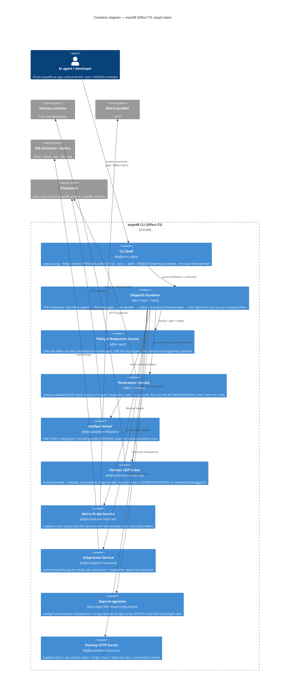
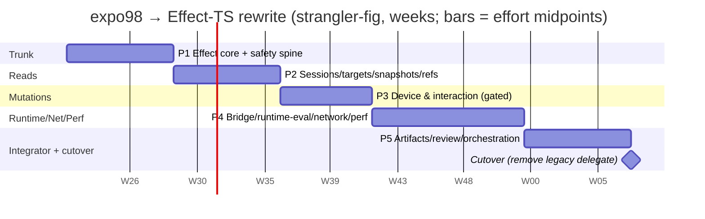

# expo98 — Modernization Brief

_Synthesized by `/code-modernization:modernize-brief` on 2026-05-24 from `ASSESSMENT.md`, `TOPOLOGY.html` (+ `ARCHITECTURE.mmd`, `call-graph.mmd`, `critical-path.mmd`, `data-lineage.mmd`), `BUSINESS_RULES.md`, `DATA_OBJECTS.md`, and the `reimagine/` greenfield model (`entities.md`, `interfaces.md`, `rules-gwt.md`)._
_Directed target stack (from the command): **rewrite entirely on [Effect-TS](https://github.com/effect-ts/effect)** — modern TS, performant, expo-plugin-sdk, official libraries, streaming progress, POSIX-compliant, agent-optimised._

> **⚠️ Steering-committee decision required before Phase 1 (read this first).**
> The discovery phase (`ASSESSMENT.md`) **recommended Refactor-in-place (~2–2.5 person-months)** and explicitly judged a rewrite to be _"waste"_ — expo98 is already a current TypeScript/ESM codebase, not a legacy runtime. This brief, as directed, plans the **full Effect-TS rewrite instead** (~31–42 person-weeks ≈ **7.5–10.5 PM**, i.e. roughly **3–4× the hardening-in-place cost**). The rewrite buys a _structurally_ fail-closed safety model, official libraries, and streaming/agent ergonomics that a refactor delivers only by convention. **The committee must consciously accept the rewrite path and its cost over hardening-in-place** — this is Open Question #1 and gates everything below. _(**Resolved 2026-05-24:** committee approved the **full 5-phase rewrite**; all 18 open questions answered — see §6 and §7.)_

---

## 1. Objective

Replace expo98 — a local-first evidence CLI for Expo / React Native iOS work (inspect a running app over Hermes CDP, drive the iOS simulator via `xcrun`/`simctl`, probe Metro, capture redacted reproducible evidence) — **from** a hand-rolled 26.5 KSLOC TypeScript CLI whose two load-bearing safety promises (**fail-closed** on state-changing actions, **redact** secrets before they leave the process) are enforced _per-command by convention_ and silently bypassed in three places, **to** a from-scratch **Effect-TS** application where those promises are **structural invariants** of a single dispatch chokepoint. We do this now because the analysis is complete and the contract is small and fully specified (75 commands, ~46 handlers, one runtime dependency, no database), so the rewrite can be driven test-first against a known behavior contract; and because the same pass lets us adopt official libraries (`@effect/cli`, `@effect/platform`, the Expo plugin SDK) that delete the largest debt in the repo — the "simulated monorepo" with its 26× duplicated helpers and three divergent redactors — while adding streaming progress and POSIX/agent ergonomics the convention-bound legacy can't cleanly retrofit.

---

## 2. Target Architecture

End state: a single Effect-TS CLI binary whose runtime is a composition of typed **services (Layers)**. The legacy "policy is applied per handler" model is replaced by **one dispatch chokepoint** that classifies side-effects, enforces the fail-closed gate, and runs the single redactor/truncator at the output boundary — making RULE-001/002/003/010/011/012/013/025/030 _impossible to bypass_ rather than merely _intended_.



### Legacy → target mapping

| Legacy component (domain)                                                                                                                                                                                      | Target container / module                                         | Change                                                                                                                                                                               |
| -------------------------------------------------------------------------------------------------------------------------------------------------------------------------------------------------------------- | ----------------------------------------------------------------- | ------------------------------------------------------------------------------------------------------------------------------------------------------------------------------------ |
| D1 CLI Framework (`cli-argv-parser`, `cli-runtime-composition`, `command-dispatch-envelope`, `command-surface`, `tool-handler-registry`, `tool-json-envelope`, `cli-help-surface`, `cli-error-classification`) | **CLI Shell** + **Dispatch Runtime**                              | Hand-rolled argv → `@effect/cli`; route table → typed command registry; dispatch becomes the single gate+redact chokepoint. Adds NDJSON streaming + POSIX hardening.                 |
| D2 Policy & Redaction (`policy-redaction`)                                                                                                                                                                     | **Policy & Redaction Service**                                    | Three divergent redactors + three side-effect classifiers collapse to **one** of each (AC-002/003). Gate moves from per-handler to dispatch (AC-010/011 fixed structurally).         |
| D3 Persistence (`session-run-records`, `target-management`)                                                                                                                                                    | **Persistence Service**                                           | JSON repos behind Schema-validated structs; same file layout/paths so existing artifacts stay readable. Run-record writes become observational (AC-025).                             |
| D4 Device Protocol (`hermes-cdp-client`, `metro-probes`)                                                                                                                                                       | **Hermes CDP Client** + **Metro Probe Service**                   | Preserve connection model; **enforce loopback** on the WS target (AC-030). **`ws` is dropped** — CDP runs over `@effect/platform` sockets, leaving **zero non-Effect runtime deps**. |
| D5 Discovery/Doctor (`project-info-doctor`, `device-listing`, `router-sitemap`, `expo-introspection-actions`, `rn-introspection`, `plugin-self-management`)                                                    | **Expo Integration** + read handlers                              | Hand-rolled Expo/RN introspection → **official Expo plugin SDK / `@expo/config-plugins`** where it replaces private-internals reliance (AC-020 table moves to data/manifest).        |
| D6 App & Sim Lifecycle; D7 Interaction/Gestures                                                                                                                                                                | Device/interaction handlers over **Subprocess Service**           | Seven hand-rolled `execFile` wrappers → one uniform subprocess service; drop the 2 `sh -lc` probes; preserve argv-only (no shell).                                                   |
| D8 Snapshot & Accessibility                                                                                                                                                                                    | Snapshot handlers over **CDP** + **Subprocess** + **Persistence** | Preserve semantic→native fallback; confine artifact writes (AC-013).                                                                                                                 |
| D9 Bridge (`bridge-command-adapter`, `bridge-domain-actions`)                                                                                                                                                  | **Expo Integration** (bridge) + gated domain handlers             | In-app devtools bridge delivered via the **official Expo DevTools plugin SDK** instead of hand-generated source; bridge-health state machine built for real (AC-028).                |
| D10 Runtime & DevTools (`devtools-diagnostics`, `navigation-deeplinks`, `runtime-inspector-actions`, `debug-inspect-highlight`, `modal-blocker-actions`)                                                       | DevTools handlers over **CDP**                                    | `trace` / `inspector` mutating actions become gated `runtime-eval` (AC-010/011). `devtools` stops re-implementing redaction/CDP.                                                     |
| D11 Network & Perf (`network-evidence`, `perf-evidence`)                                                                                                                                                       | Network/Perf handlers over **CDP** + **Artifact Writer**          | Strong network redactor folds into the unified redactor; perf compare becomes direction-aware (AC-049).                                                                              |
| D12 Artifacts/Review/Observability (`record-artifacts`, `annotate-screen-artifacts`, `review-*`, `ux-context-capture`, `dashboard-observability`, `batch-orchestration`, `live-backlog`)                       | Artifact/review handlers + **Overlay HTTP Server**                | Overlay server hardened (token/Origin/body-cap/schema, AC-014); `batch` fan-out → in-process Effect fibers (AC-031); live-backlog fixtures → project config (AC-058).                |
| `cli/expo98.mjs` (17.4 KLOC esbuild bundle) + `expo-ios` alias                                                                                                                                                 | Build output of the Effect app; **both bin names preserved**      | Bundle becomes a build artifact again; legacy bundle is the strangler delegate during migration, then removed at cutover.                                                            |

---

## 3. Phased Sequence

**Strangler-fig ordering.** Phase 1 builds the new Effect core _with the safety spine baked in_ and a passthrough adapter that delegates any not-yet-ported command to the committed legacy bundle (`cli/expo98.mjs`). Each subsequent phase strangles one cluster of commands, lowest-dependency / lowest-risk first (reads → stateful reads → device mutations → runtime-eval/network/perf → the integrator). The legacy bundle is deleted only at the final cutover. Effort is derived from the source COCOMO anchor (75–108 PM to rebuild blind) **discounted** because the behavior contract already exists (this analysis), the surface is small (~46 handlers, one runtime dep), and Effect/official-libs delete the duplicated-helper boilerplate that inflates legacy LOC — and apportioned by each cluster's measured complexity (CCN) share.

### Phase 1 — Strangler trunk: Effect core + safety spine

- **Scope (legacy → target):** D1 + D2 + D3 (run-records) + D4 primitives. Build CLI Shell (`@effect/cli`, POSIX flags/exit codes, `--json|--plain|NDJSON`), Dispatch Runtime (the gate+redact chokepoint), Policy & Redaction Service (one classifier, one gate, one redactor = strongest superset), Subprocess Service, Hermes CDP Client (loopback-enforced) + Metro Probe Service, Persistence Service (observational run-records), Artifact-root confinement primitive. Port the no-IO read/meta commands as first proof: `policy`, `redact`, `doctor`, `project-info`, `routes`, `devices`, `skills`, `install`, `upgrade`, `release`. **Legacy passthrough adapter** shells every other command to `cli/expo98.mjs`.
- **Entry criteria:** Brief approved (Open Q#1–8 resolved); golden-output corpus captured from the legacy bundle; CI green on legacy.
- **Exit criteria:** 100% of 75 commands invocable through the new dispatcher (delegating where un-ported); **AC-001/002/003** proven on a smoke set; dual-run `--json` diff green for the ported read commands; bundle-build + golden-harness wired in CI; exit codes 0/1/2 match legacy (AC-015/016).
- **Effort:** ~6–8 pw. **Risk: Medium–High** (foundation defines the whole safety model). Top risks: (1) `@effect/cli` argv semantics drift from legacy flag parsing → mitigate with the contract test on every global flag + the `runs`-parent quirk decision (Open Q#9); (2) over-abstracting the Layer graph → mitigate with the architecture-critic review before Phase 2.

### Phase 2 — Sessions, targets, snapshots & refs (evidence spine)

- **Scope:** D3 (sessions/targets) + D5 stateful (`session`, `target`) + D8 (`snapshot`, `accessibility`) + D7 read paths (`refs`, `get`, `find`, `wait`, `inspect`). Read-mostly; writes only state + confined artifacts.
- **Entry criteria:** Phase 1 exit met; AC-013 confinement primitive merged; Schema structs for SessionRecord/TargetRecord/SnapshotResult/RefCache unified to the strict variant (per `entities.md` schema-drift note).
- **Exit criteria:** **AC-017/018/019/024/026** equivalence vs legacy on the fixture corpus; **AC-013** path-confinement property test passes (no `../`/absolute escape); snapshot semantic→native fallback parity; `wait` cadence (AC-035) parity.
- **Effort:** ~6–8 pw (snapshot-evidence is high-CCN: 140 + 105). **Risk: Medium.** Top risks: (1) snapshot/ref-cache pointer invariants (`activeTargetId`/`lastSnapshotId`/`refs.json` must agree) → mitigate with characterization tests on the three Session pointers; (2) semantic-bridge capture depends on the Phase 4 bridge → mitigate by keeping native (`axe`) fallback first-class in Phase 2 and deferring semantic parity to Phase 4.

### Phase 3 — Device & interaction mutations (first gated writes)

- **Scope:** D6 (`boot-simulator`, `open-url`, `launch-app`, `terminate-app`, `reload-app`, `install-app`, `uninstall-app`, `open-route`, `set`) + D7 device actions (`tap`, `gesture`, ref-actions, `type`/`press`/`keyboard`, `clipboard`, `screenshot`).
- **Entry criteria:** Phase 1 gate proven; subprocess service hardened; a real iOS simulator available for UAT; Open Q#13 (crash-grace default) resolved.
- **Exit criteria:** **AC-005** (every device action fails closed; denial performs zero `xcrun`/`simctl`) proven; **AC-029/056** crash-evidence + non-zero grace; `--dry-run` plan parity (AC-005); gesture/scroll math parity (AC-036/037); screenshot stitch geometry parity (AC-054). Manual UAT on simulator signed off.
- **Effort:** ~5–7 pw (app-lifecycle CCN 112). **Risk: Medium–High** (first real mutations; hardest to auto-verify). Top risks: (1) device side-effects can't be dual-run-diffed safely → mitigate with mock-subprocess contract tests + gated manual UAT; (2) crash-report scan timing flakiness → mitigate with a fixed `crashCheckMs` default and deterministic clock injection.

### Phase 4 — Runtime-eval, bridge, network & perf (highest complexity + the FIX cluster)

- **Scope:** D9 (`bridge`, `storage`, `state`, `controls`) + D10 (`devtools`, `console`, `errors`, `navigation`, `open-dev-menu`, `inspector`, `trace`, `highlight`) + D11 (`network`, `perf`, `profiler`, `metro`, `logs`). This is where the runtime-eval gating defects are fixed and bridge-health is built for real.
- **Entry criteria:** Phase 1 runtime-eval gate class proven; Open Q#1–7 (trace/inspector gating, redactor superset, classifier, CDP loopback, output budget) confirmed; Open Q#18 (bridge-health wiring) answered; Expo plugin SDK selection (Open Q#10) confirmed.
- **Exit criteria:** **AC-006/007/010/011/012** gating proven (trace + inspector mutations now denied without policy/flag); **AC-030** loopback on WS; **AC-022** network shape/redaction; **AC-028** real bridge-health state machine; **AC-046–052** perf parity incl. direction-aware compare (AC-049); network redactor folded into the unified redactor with zero leak (property test).
- **Effort:** ~8–11 pw (the highest-CCN cluster: network-evidence 187, devtools-diagnostics 142, bridge-domain 120, perf split). **Risk: High.** Top risks: (1) intentional behavior changes (trace/inspector now gated, perf direction) break naive dual-run diff → mitigate by marking these FIX cases and writing new assertion tests, not equivalence diffs; (2) bridge-health has no live legacy backing (stub) → mitigate by treating AC-028 as net-new spec requiring SME sign-off before coding.

### Phase 5 — Artifacts, review, orchestration & cutover (the integrator)

- **Scope:** D12 (`record`, `diff`, `ux-context`, `annotate-screen`, `review-overlay` + hardened server, `review-overlay-server`, `review-next`, `review`, `dashboard`, `live-backlog`, `batch`). Then **cutover**: remove the legacy passthrough, delete reliance on the legacy bundle, ship the Effect build under both bin names.
- **Entry criteria:** Phases 1–4 exit met; Open Q#11 (overlay contract) + Q#14 (backlog fixtures→config) confirmed; full regression suite green.
- **Exit criteria:** **AC-014** (overlay token/Origin/body-cap/schema), **AC-031** (batch as in-process fibers, exit code isolation), **AC-032/057/058** parity; legacy passthrough removed; **both `expo98` and `expo-ios` bins preserved** as identical impl; full P0+P1 regression green; `npx expo98` works from the committed build.
- **Effort:** ~6–8 pw (live-backlog CCN 216 dominates). **Risk: Medium.** Top risks: (1) D12 depends on every other domain → it genuinely must go last; mitigate by gating Phase 5 start on Phases 1–4 exit; (2) cutover regressions → mitigate by running the dual-run diff across the _entire_ corpus one last time before deleting the legacy delegate.



> Calendar is illustrative for a 2–3 engineer team running phases largely in sequence (the dependency graph forbids most parallelism — D12 depends on all). Sum of effort midpoints ≈ **37 pw ≈ 9 PM**, within the **31–42 pw (7.5–10.5 PM)** band and far below the **75–108 PM** blind-rebuild COCOMO anchor.

---

## 4. Behavior Contract (P0 — must be proven equivalent before any phase ships)

These ten P0 rules are the regression suite floor — the manifestations of **fail-closed** + **redact** + **loopback-only**. Each is tied to the phase that owns it; that phase cannot exit until its P0 rules are proven (equivalence for PRESERVE, new assertion tests for FIX).

| P0     | Rule     | Invariant                                                                                         | Conf. (what the code does) | Decision                                  | Owning phase                 |
| ------ | -------- | ------------------------------------------------------------------------------------------------- | -------------------------- | ----------------------------------------- | ---------------------------- |
| AC-001 | RULE-001 | State-changing actions denied unless policy allows the exact action; reads always pass            | **High**                   | PRESERVE                                  | P1                           |
| AC-002 | RULE-002 | ONE side-effect classifier (read/device/runtime-eval); unknown ⇒ device (fail-closed)             | **High**                   | **FIX** (unify 3 copies)                  | P1                           |
| AC-003 | RULE-003 | ONE redactor (strongest key superset) at the single output boundary                               | **High**                   | **FIX** (3 divergent → 1)                 | P1                           |
| AC-005 | RULE-005 | boot/launch/terminate/reload/install/uninstall gated; denial does zero `xcrun`/`simctl`           | **High**                   | PRESERVE                                  | P3                           |
| AC-006 | RULE-006 | storage/state/controls writes gated; returned value redacted + bounded; defense-in-depth re-check | **High**                   | PRESERVE                                  | P4                           |
| AC-007 | RULE-007 | nav `state` ungated read; back/pop-to-root/tab/deep-link gated                                    | **High**                   | PRESERVE                                  | P4                           |
| AC-010 | RULE-010 | `trace` (injects JS, patches RAF + DevTools commit hook) classified `runtime-eval` and gated      | **High**                   | **FIX** (legacy ungated)                  | P4                           |
| AC-011 | RULE-011 | `inspector` mutating actions gated; reads classified read                                         | **High**                   | **FIX** (legacy gates only open-dev-menu) | P4                           |
| AC-012 | RULE-012 | auth headers / cookies / secret query stripped before network evidence / HAR / route URL leaves   | **High**                   | PRESERVE (fold into AC-003)               | P4                           |
| AC-013 | RULE-013 | `--output-path` resolves under the artifacts root; reject `../`/absolute                          | **High**                   | **FIX** (legacy unconfined)               | P2 (primitive) / all writers |

**Supporting non-P0 invariants promoted into the regression floor:** **AC-030** (loopback-only CDP, P1, FIX), **AC-021** (loopback-only Metro, P1), **AC-025** (run-record write is observational — never alters exit code, P1, FIX, integrity). These are network-confinement and control-flow-integrity floors and are treated as release-gating alongside the P0 set.

**Confidence-gate result.** Per the brief's blocker rule — _flag any P0 with Confidence < High_ — **none of the ten P0 rules is below High confidence in what the code does.** So there is no _confidence_ blocker. However, **five P0 rules are FIX decisions** (AC-002/003/010/011/013) and one supporting rule is a FIX (AC-025): these require an explicit SME **"confirm the fix"** sign-off before their owning phase starts, because a from-scratch build will intentionally diverge from legacy behavior there. Those sign-offs are Open Questions #2–#7 and are the _real_ blockers. Additionally **AC-028 (bridge-health)** is P1 / **Medium** confidence with **no live legacy implementation** — it is a net-new spec and a hard blocker for Phase 4 (Open Q#18).

---

## 5. Validation Strategy

Combination, justified per phase. The pivot: **PRESERVE** rules are validated by _equivalence_ (golden + dual-run diff against the legacy bundle); **FIX** rules cannot be — legacy is wrong there — so they get _new assertion tests_ that encode the corrected behavior.

| Phase  | Characterization (golden)      | Contract (envelope/exit/classify)  | Dual-run / diff vs legacy                                                       | Property-based                                                     | Manual UAT                      | Why this mix                                                                                                                             |
| ------ | ------------------------------ | ---------------------------------- | ------------------------------------------------------------------------------- | ------------------------------------------------------------------ | ------------------------------- | ---------------------------------------------------------------------------------------------------------------------------------------- |
| **P1** | ✓ read/meta commands           | ✓ flags, exit 0/1/2, JSON envelope | ✓ ported reads                                                                  | ✓ redactor (no secret survives), clamps, id format                 | —                               | Pure-read & deterministic → diff is cheap and decisive; redaction is safety-critical → property test that _no_ known secret key escapes. |
| **P2** | ✓ session/snapshot/refs        | ✓ `available:false`+code shape     | ✓ all (read-mostly)                                                             | ✓ **path confinement** (no escape), wait cadence, depth clamps     | —                               | State + artifacts but no device mutation → still safe to dual-run; confinement is a security FIX → exhaustive property test.             |
| **P3** | ✓ dry-run plans                | ✓ gate decisions                   | partial — **mocked subprocess only** (real device mutations are not idempotent) | ✓ gesture/scroll/stitch math                                       | **✓ required** (real simulator) | Device mutations can't be safely diffed live → mock contract tests + human UAT on a real sim.                                            |
| **P4** | ✓ network/perf reads           | ✓ runtime-eval gate, codes         | ✓ **PRESERVE only** (network shape, perf calc); **FIX cases excluded**          | ✓ redactor superset, perf direction map, HAR/waterfall derivations | ✓ bridge/trace/inspector on sim | trace/inspector/perf-direction are intentional FIXES → assertion tests, not diff; everything else dual-runs.                             |
| **P5** | ✓ overlay events, backlog rows | ✓ batch exit-code isolation        | ✓ full-corpus diff at cutover                                                   | ✓ overlay body-cap/token/Origin, batch fiber isolation             | ✓ overlay server, dashboard     | Integrator → re-run the entire diff corpus once more before deleting the legacy delegate; security FIXES on overlay get property tests.  |

Cross-cutting, every phase: a **source↔build parity check** in CI (the legacy's missing safeguard, ASSESSMENT debt #8) so the shipped binary always matches source; and an **independent `architecture-critic` review** at each phase boundary to catch Effect over-abstraction before it compounds.

---

## 6. Open Questions — RESOLVED (SME / committee sign-off 2026-05-24)

All 18 were answered on 2026-05-24. Decisions below are now **binding inputs** to the phases that own them.

**Strategic (gated the whole brief):**

- [x] **#1 Rewrite vs Refactor → FULL REWRITE.** Committee approved the full 5-phase Effect-TS rewrite (~7.5–10.5 PM) over Refactor-in-place. Approval covers the **full plan** (§7).

**P0/safety FIX sign-offs (Phase 1 core design + owning phases):**

- [x] **#2 (AC-002)** **Unify the classifier** to one source of truth (read/device/runtime-eval), unknown ⇒ device.
- [x] **#3 (AC-003)** **One strongest-superset redactor** (`authorization|bearer|cookie|set-cookie|token|secret|password|pwd|api[-_]?key|apikey|x-api-key|client_secret|refresh|credential|session|auth`) at the single output boundary; remove the two weaker copies.
- [x] **#4 (AC-010)** `trace.*` becomes **gated `runtime-eval`** (policy / `--allow-runtime-eval`).
- [x] **#5 (AC-011)** `inspector` mutating actions (`install-comment-menu`/`clear-comments`/`toggle`) **gated**; `probe`/`read-comments` classified read.
- [x] **#6 (AC-013)** **Confine `--output-path`** under the resolved artifacts root (`resolved.startsWith(artifactsRoot)`).
- [x] **#7 (AC-025)** Run-record write failure **may never change the exit code** — recording is strictly observational.
- [x] **#8 (AC-030 / AC-041)** CDP client **enforces the loopback allowlist** on `webSocketDebuggerUrl`. Canonical output budget = **40,000-char payload limit, one overflow marker, subprocess `maxBuffer` set well above the truncation limit** (never clips).

**Stack / library selection:**

- [x] **#9** Stack = `effect` + `@effect/cli` + `@effect/platform`(`-node`); **CDP runs over `@effect/platform` sockets — `ws` is dropped** → zero non-Effect runtime deps. Versions pinned in the Phase 1 spike against official docs (Context7 was unavailable here). The **`--state-dir` basename-`runs`→parent quirk is DROPPED** (`--state-dir` is treated literally).
- [x] **#10 (AC-020 / D9)** Adopt the **official Expo DevTools Plugins SDK + `@expo/config-plugins`** to replace hand-rolled introspection and the hand-generated in-app bridge. The **Expo→RN compatibility map moves to a data file / manifest** updatable without a code release.

**Owning-phase decisions:**

- [x] **#11 (AC-014, P5)** Overlay server: **full hardening** — loopback + unguessable per-session token + strict Origin + hard body cap + `comments[]` schema.
- [x] **#12 (AC-028, P4)** **Build the real bridge-health state machine** (net-new spec; SME supplies the ordered check set install-state→transport→registration→version). Do **not** preserve the stub.
- [x] **#13 (AC-056, P3)** `crashCheckMs` defaults to **1000 ms**.
- [x] **#14 (AC-058, P5)** Live-backlog substitutions become **required inputs / project config** — no baked-in fixtures.
- [x] **#15 (AC-049, P4)** Higher-is-better metric set = **`avgFps`, throughput/req-per-sec, counts-of-good**; everything else lower-is-better.
- [x] **#16 (AC-034)** Ids treated as **globally unique**: collision-resistant id (UUID/nanoid) + a single unified timestamp format.
- [x] **#17 (AC-033, P5)** **Implement a real `running→stale→stopped` sidecar lifecycle** for long-lived servers (e.g. the overlay server).
- [x] **#18 (AC-008/047/052/037)** **Gate `review-overlay scaffold` behind a confirm token** (AC-008); **correct frame budgets to exact 33.33/16.67** (AC-047); **revisit the swipe→content scroll mapping in Phase 3** (AC-037 — do not blindly preserve); **preserve the macOS `sample` parser** as-is with the assumed Instruments version pinned in a comment (AC-052).

---

## 7. Approval Block

```
Approved by: ________________  Date: 2026-05-24
Approval covers:  Phase 1 only  |  [✔] Full plan
Open Questions resolved at approval: #1–#18 (all)
```

> Recorded outcome: the committee approved the **full plan** and resolved **all 18 open questions** on 2026-05-24 (decisions in §6). Two items carry forward as _in-phase work_, not blockers: **AC-028** (bridge-health) is net-new spec to be detailed before Phase 4 coding; **AC-037** (scroll mapping) is to be re-examined during Phase 3. The signature line above remains for the human approver's countersignature.

---

_Inputs: `ASSESSMENT.md`, `TOPOLOGY.html` (+ `ARCHITECTURE.mmd`, `call-graph.mmd`, `critical-path.mmd`, `data-lineage.mmd`), `BUSINESS_RULES.md`, `DATA_OBJECTS.md`, `reimagine/{entities,interfaces,rules-gwt}.md`. Next step after approval: `/code-modernization:modernize-reimagine expo98 "<approved target vision>"` for the greenfield build, or `/code-modernization:modernize-transform expo98 <module> <stack>` to strangle a single command family per Phase 1's passthrough plan._
