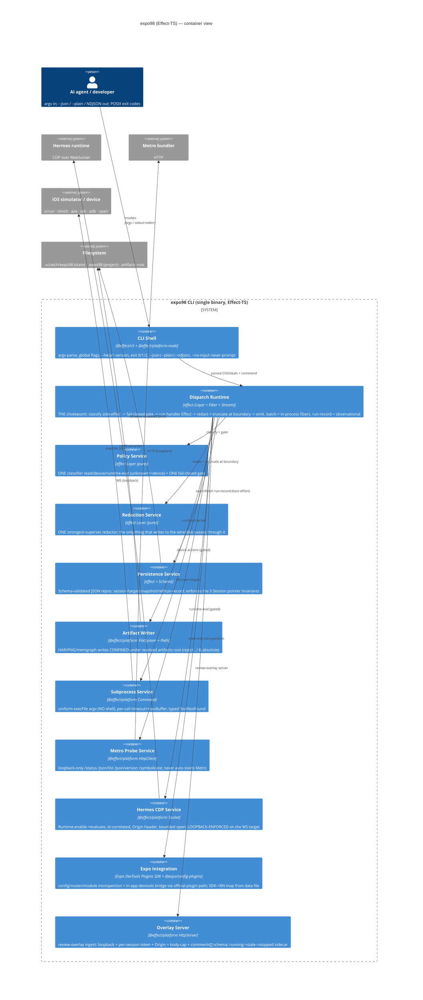

# expo98 — Reimagined Architecture (Effect-TS)

_Phase C of `/modernize-reimagine`. Designed against `AI_NATIVE_SPEC.md` + `reimagine/_`; builds on the approved `MODERNIZATION*BRIEF.md` §2 and incorporates Phase B (HITL #1) decisions.\*
\_Target vision (verbatim): rewrite entirely on **Effect-TS** — modern TS, performant, expo-plugin SDK, official libraries, streaming progress, POSIX-compliant, agent-optimised.*

> **Status:** draft → reviewed by `architecture-critic` → revised. See §7 for the critique and resolutions.

---

## 1. One-line thesis

expo98's reason to exist is its **safety spine**, which the legacy enforces _per-command by convention_ (and three commands bypass). The reimagined system makes the spine a **type-level property via capability injection**, not merely a "chokepoint":

> The side-effect class is a **required field of each typed command** (classified once, `Match.exhaustive` over the command union). The dispatcher **constructs the dangerous capabilities — runtime-eval, device, source-write — and provides them into a handler's Effect `R` environment _only after the gate passes for that command's class_.** A `read`-classed (or new, unclassified) handler's `R` channel simply _lacks_ the runtime-eval/device capability, so calling it is a **compile error**, not a runtime convention.

This is the correction from the architecture-critic pass (§7, finding C1): a dispatch chokepoint that classifies by action-name string and lets every handler freely inject the CDP service merely _renames_ the legacy defect one layer up. Capability-withholding makes "a handler cannot reach runtime-eval ungated" a fact the type-checker enforces. Everything else in this document serves that one move.

---

## 2. C4 Container diagram (target state, post Phase-B drops)

**Removed vs the brief's diagram (Phase B):** the dedicated _Recording_ path (video `record` command) is gone; the Overlay container is **ingest/evidence only** — no in-app HTML/UI component scaffolding.

---

## 3. Service boundaries (which rule/entity lives where)

Services in **one binary**. Boundaries are by _responsibility + consistency_, not deployment. The non-negotiable layering rule, **CI-enforced as an acyclic package DAG** (finding M4 — `dependency-cruiser`/eslint-boundaries in the scaffold, so the legacy D1↔D2 cycle cannot reappear): `core` → nothing; `domain` → `core`; `protocols` → `core`; handlers → all; the pure spine (Policy/Redaction/Dispatch) imports **nothing platform-specific** (no `@effect/platform-node`).

**The S4 classifier has four side-effect tiers** (revised per finding C2): `read` (ungated) · `device` (gated) · `runtime-eval` (gated, injected-JS) · `source-write` (gated **+ confirmation token**, AC-008 — bridge install/remove). Unknown ⇒ `device` (fail-closed). The class is a **required field on the typed command**, not derived from a name regex.

| #   | Service                                                       | Tech                                                      | Owns (rules / entities)                                                          | Rationale                                                                                                                                                                                                               |
| --- | ------------------------------------------------------------- | --------------------------------------------------------- | -------------------------------------------------------------------------------- | ----------------------------------------------------------------------------------------------------------------------------------------------------------------------------------------------------------------------- |
| S1  | **Subprocess**                                                | `@effect/platform` `Command`                              | AC-053 timeouts/buffers; 7 legacy `execFile` wrappers + 2 `sh -lc` collapse here | One typed boundary per external binary; argv-only kills CWE-78 by construction                                                                                                                                          |
| S2  | **Path confinement** _(function, not a Layer — N1)_           | `@effect/platform` `Path`                                 | **AC-013** — `confinePath(root, candidate): Effect<Path, PathEscape>`            | Confinement is one pure assertion every writer calls; a Layer buys nothing                                                                                                                                              |
| S3  | **Clock / Id** _(thin Layer, for test determinism only — N1)_ | `effect` `Clock` + id gen                                 | AC-034 (collision-resistant id, single timestamp), AC-056 grace clock            | Layer **only** because deterministic time/ids make crash-grace tests reproducible                                                                                                                                       |
| S4  | **Policy** (pure)                                             | `effect` Layer                                            | **AC-001, AC-002** (4-tier classifier), AC-004/005/006/007/008 gate decisions    | ONE classifier + ONE gate, classifying a required typed field. Pure ⇒ property-testable                                                                                                                                 |
| S5  | **Redaction** (pure)                                          | `effect` Layer                                            | **AC-003, AC-012** (folded)                                                      | ONE strongest-superset redactor over whole _values_ (not wire-chunks — M2)                                                                                                                                              |
| S6  | **Dispatch Runtime**                                          | `effect` Layer+Fiber+Stream                               | **AC-015/016/025/031/041**; orchestrates S4+S5                                   | **Capability injection**: classify → gate → _provide device/eval/source-write capability into the handler `R` only if the gate passed_ → run → redact → truncate → emit. This is what makes AC-010/011 a type fact (§1) |
| S7  | **Persistence**                                               | `effect` + `Schema`                                       | AC-017/018/019/024/026/043; Session·Target·Snapshot·Ref·RunRecord                | Schema structs + the 3 Session pointer invariants as one repo's job                                                                                                                                                     |
| S8  | **Metro Probe**                                               | `@effect/platform` `HttpClient`                           | **AC-021**, AC-038                                                               | loopback-only, never auto-start, skip-malformed                                                                                                                                                                         |
| S9  | **Hermes CDP** _(split surface)_                              | `@effect/platform` `Socket` **or thin `ws` adapter** (M1) | **AC-030**, AC-022 transport                                                     | loopback+Origin+bounded-open. Interface **splits** a read-eval surface (evidence harvesting, e.g. `network`) from the runtime-eval-mutation surface S6 withholds unless class=`runtime-eval`                            |
| S10 | **Expo Integration**                                          | Expo DevTools Plugins SDK + `@expo/config-plugins`        | AC-020 (compat map→data), AC-028 bridge-health, AC-027/009                       | official plugin path replaces hand-rolled introspection + hand-generated bridge                                                                                                                                         |
| S11 | **Overlay Server**                                            | `@effect/platform` `HttpServer`                           | **AC-014**, AC-032, **AC-033 sidecar lifecycle** (`running→stale→stopped` — N4)  | the one inbound listener; hardened; ingest-only (no HTML scaffold)                                                                                                                                                      |
| S12 | **CLI Shell** _(own package, NOT in `core` — M3)_             | `@effect/cli` + `@effect/platform-node`                   | global flags, POSIX exit codes, `--json\|--plain\|--ndjson`                      | inbound adapter; isolating it keeps the pure spine free of `@effect/platform-node`(+`ws`)                                                                                                                               |

**Handler modules (thin Effects), grouped by capability:** C3 discovery, C4 sessions/refs, C5 app/sim lifecycle (gated), C6 interaction (gated), C7 bridge domains (gated; AC-006 keeps an intentional **defense-in-depth re-check** — belt-and-suspenders, _not_ the primary gate, which is S6 — N3), C8 devtools/trace/inspector (runtime-eval gated), C9 network/perf, C10 artifacts/review/batch/live-backlog. A handler is `Effect<PayloadDTO, DomainError, RequiredCapabilities>` and **cannot name S4/S5 or the withheld S9/device capabilities** — the gate/redactor are applied _to_ it by S6, and the dangerous capabilities are only in its `R` when the gate allowed them.

---

## 4. Technology choices (one-line justification each)

| Choice                                                                     | Why                                                                                                                                                                                                                                                                                                                                                                                                      |
| -------------------------------------------------------------------------- | -------------------------------------------------------------------------------------------------------------------------------------------------------------------------------------------------------------------------------------------------------------------------------------------------------------------------------------------------------------------------------------------------------- |
| **`effect` (core)** — Effect, Layer, Context, Stream, Schema, Match, Clock | one dependency-injection + error + concurrency + schema model; Schema lives in core (`effect/Schema`), so DTOs and validation are first-class                                                                                                                                                                                                                                                            |
| **`@effect/cli`**                                                          | declarative commands/options/args → POSIX flags, `--help`, shell completion, exit codes for free; replaces the hand-rolled argv parser (legacy debt)                                                                                                                                                                                                                                                     |
| **`@effect/platform` + `@effect/platform-node`**                           | one portable abstraction for `Command` (subprocess), `FileSystem`/`Path`, `HttpClient`, `HttpServer`, `Socket`; Node layer supplies the impls; keeps handlers platform-agnostic and test-mockable                                                                                                                                                                                                        |
| **`Stream` for NDJSON**                                                    | streaming progress = a `Stream<RedactedEvent>` serialized one-JSON-per-line. **Per finding M2:** (1) redaction operates on whole _values_ before serialization (never on wire-chunks, so a secret can't split across two events); (2) the 40,000-char budget (AC-041) is a **running total across the stream** with one terminal overflow marker — not per-event. This keeps C1.2 intact under streaming |
| **`Schema` for every DTO + every JSON file read**                          | parse-don't-validate at the persistence + policy-file boundary; resolves the 3× `SessionRecord` drift by having exactly one struct                                                                                                                                                                                                                                                                       |
| **`@effect/vitest`** (test)                                                | run `Effect` acceptance tests directly; property tests via `effect/FastCheck` for the redactor + path-confinement invariants                                                                                                                                                                                                                                                                             |
| **Expo DevTools Plugins SDK + `@expo/config-plugins`**                     | the official, supported introspection + in-app bridge path (Phase B keeps the bridge, drops the hand-generated component); SDK→RN map externalised to data so it updates without a release                                                                                                                                                                                                               |
| **`pnpm` workspace, esbuild build, oxlint/oxfmt, tsgo**                    | keep the legacy's proven toolchain + supply-chain delay; emit the same committed `cli/expo98.mjs` so `npx expo98` works unbuilt and both bins are preserved                                                                                                                                                                                                                                              |

**Runtime-dependency posture (reframed per finding M1 — dropping the marketing):** the goal is **not** "zero non-Effect runtime deps" — that claim is false at the lockfile (`@effect/platform-node`'s WebSocket pulls `ws` transitively) and irrelevant for a local-only CLI. The actual, dep-agnostic requirement is **loopback-enforced + connect-time `Origin` header + bounded-open CDP** (AC-030). The legacy relies on two `ws`-specific behaviors: the `Origin` request header at connect (`hermes-cdp-client/index.ts:38`) and `min(timeoutMs,2500)` bounded-open with id-correlation.

⚠️ **Spike moved EARLIER (was "before Phase 4", now "before scaffolding `packages/protocols`"):** verify `@effect/platform` `Socket` can set a **connect-time `Origin` header** on the outbound client handshake. High-level socket abstractions often don't expose this. **If it cannot, the honest design is a thin direct-`ws` adapter behind the S9 interface** — the interface boundary is what matters, the dep count is cosmetic. This gates a _day-one_ package, so it runs first (see §6).

---

## 5. Data migration approach (legacy stores → reimagined)

There is **no database** — durable state is JSON files. Migration is therefore _format-compatibility_, not ETL.

1. **Preserve the on-disk layout & paths verbatim.** `sessions/<id>/{session,target,refs}.json`, `snapshots/<sid>.json`, `<stateDir>/<runId>.json`, `<projectRoot>/.expo98/bridge.json`, `<overlayDir>/events.json`. Existing artifacts stay readable with zero conversion.
2. **Parse legacy on read via lenient Schema → write strict.** Read with a Schema that accepts the _looser_ legacy variants (e.g. `sidecars: unknown[]`, `semanticBridge: unknown`, the 3 `SessionRecord` shapes) and normalises to the strict canonical struct; subsequent writes are strict. Net: read-old / write-new, no migration script needed.
3. **`schemaVersion` already present (=1).** Keep it; bump only on a genuine breaking field change, with a forward read-shim.
4. **The two _intentional_ format shifts** (both safe-by-construction): collision-resistant ids + single timestamp format (AC-034) apply only to _new_ records; old ids remain valid keys. `--state-dir` is now literal (no `runs`-parent rewrite) — flagged as a behavior change in release notes.
5. **Strangler cutover (from the brief):** during migration the Effect binary delegates un-ported commands to the committed legacy `cli/expo98.mjs`; both read the same state root, so a session created by either is usable by both until the legacy delegate is deleted at cutover.

---

## 6. Phase E scaffold plan — 3 packages (cap honored)

One pnpm workspace at `modernized/expo98-reimagined/`. The command caps parallel scaffolding at **3**; I scaffold the **foundation that everything else compiles against**, and defer the feature-handler + integration packages (named below).

**Scaffolded now (3, in parallel):**

1. **`packages/core`** — S1 Subprocess, S2 `confinePath` (function), S3 Clock/Id, **S4 Policy (4-tier), S5 Redaction, S6 Dispatch (capability-injection gate)**. **CLI Shell (S12) is NOT here** (finding M3) — the pure spine imports nothing from `@effect/platform-node`. _Assigned ACs:_ AC-001, AC-002, AC-003, AC-008 (token tier), AC-012, AC-013 (`confinePath`), AC-015, AC-016, AC-025, AC-031, AC-034, AC-041, AC-053. **This is the P0 trunk** — the capability-withholding gate is proven here with synthetic commands, no CLI boot required.
2. **`packages/domain`** — S7 Persistence + the full Effect `Schema` domain model (Session/Target/Snapshot/Ref/RunRecord/Bridge/Overlay + value objects), with the lenient-read/strict-write migration shim (§5). _Assigned ACs:_ AC-017, AC-018, AC-019, AC-024, AC-026, AC-043; the 4 aggregate boundaries + 3 Session pointer invariants.
3. **`packages/protocols`** — S8 Metro Probe + S9 Hermes CDP. **Runs the Origin-header Socket spike FIRST** (finding M1); if `@effect/platform` Socket can't set connect-time `Origin`, the scaffold lands a thin `ws` adapter behind the S9 interface. _Assigned ACs:_ AC-021, AC-030, AC-022, AC-038.

**Deferred (named, not scaffolded this run):** `packages/app` (S12 CLI Shell + `@effect/cli` composition root — deferred because it needs the command registry the handlers populate), `packages/handlers-*` (C5–C10 incl. AC-005/006/007/010/011 gated mutations + AC-046–052 perf), `packages/expo-integration` (S10), `packages/overlay-server` (S11). Their acceptance criteria are emitted as **pending/skip tests with rule IDs** inside the relevant scaffolded package so coverage is tracked from day one. **A CI dependency-DAG check** (M4) ships in package 1's tooling.

Each scaffolded package ships: project skeleton (tsconfig/package.json/build), domain model + API stubs matching the interface contracts, and **executable acceptance tests** for its assigned rules — implemented ones pass, unimplemented ones `it.skip`/`xfail` tagged with the AC id.

---

## 7. Architecture-critic review & resolutions

The `architecture-critic` agent verified the load-bearing claims against live legacy source and returned a **conditional NO** on the draft ("delivers single-redactor + loopback structurally, but the runtime-eval gate as drafted renames the legacy defect"). All findings are resolved in §1–§6 above; the verdict flips to **YES once C1 + C2 land** (both incorporated). Record:

| #   | Sev          | Finding                                                                                                                                                                                                                                                                | Resolution (where)                                                                                                                                                                                                                                                                                                                                                             |
| --- | ------------ | ---------------------------------------------------------------------------------------------------------------------------------------------------------------------------------------------------------------------------------------------------------------------- | ------------------------------------------------------------------------------------------------------------------------------------------------------------------------------------------------------------------------------------------------------------------------------------------------------------------------------------------------------------------------------ |
| C1  | **Critical** | The "chokepoint" classifies by action-name and S9 CDP is freely injectable by 11 handlers ⇒ a `read`-classed handler can still call runtime-eval. Renames the legacy disease. (`network` is `read` yet legitimately evaluates, so the gate must key on command class.) | **Accepted — core redesign.** §1 + §3 S6: side-effect class is a **required typed field** (`Match.exhaustive`); S6 uses **capability injection** — device/runtime-eval/source-write capabilities enter the handler `R` _only after the gate passes_. S9's surface is **split** (read-eval for evidence vs. mutation-eval withheld). A miswired handler is a **compile error**. |
| C2  | **Critical** | AC-008 (confirmation tokens) is a fail-closed invariant but was parked in deferred S10 — gate scattered again.                                                                                                                                                         | **Accepted.** §3: added a 4th classifier tier **`source-write`** (gated + token) in S4/S6; AC-008 reassigned to `core` package 1.                                                                                                                                                                                                                                              |
| M1  | Major        | "Zero non-Effect runtime deps" is false (`ws` transitive) and the real risk is whether `@effect/platform` Socket can set a connect-time `Origin` header (AC-030). Spike gates a day-one package.                                                                       | **Accepted.** §4: dropped the claim; reframed as loopback+Origin+bounded (dep-agnostic). §6: spike runs **before** scaffolding `protocols`; thin `ws` adapter behind S9 is the sanctioned fallback.                                                                                                                                                                            |
| M2  | Major        | Per-event NDJSON redaction can leak a secret split across events; per-event truncation can blow the aggregate AC-041 budget.                                                                                                                                           | **Accepted.** §4 Stream row: redact **whole values pre-serialization**; AC-041 budget is a **running total** with one terminal marker.                                                                                                                                                                                                                                         |
| M3  | Major        | `core` bundling CLI Shell pulls `@effect/platform-node`(+`ws`) into the "pure, property-testable" spine.                                                                                                                                                               | **Accepted.** §3 S12 + §6: CLI Shell moved to its own deferred `packages/app`; `core` spine imports nothing platform-specific.                                                                                                                                                                                                                                                 |
| M4  | Major        | No enforced acyclic DAG despite the legacy D1↔D2 cycle.                                                                                                                                                                                                                | **Accepted.** §3 + §6: explicit DAG (`core`→nothing; `domain`/`protocols`→`core`; handlers→all) + a CI dependency-cruiser check in package 1.                                                                                                                                                                                                                                  |
| N1  | Minor        | 12 Layers is ceremony; S2 Artifact Writer is one assertion; S3 only justified by test determinism.                                                                                                                                                                     | **Accepted.** §3: S2 demoted to a `confinePath` **function**; S3 kept as a thin Layer _only_ for deterministic test time/ids.                                                                                                                                                                                                                                                  |
| N2  | Minor        | `@effect/cli` flag semantics will drift from the contractual exit-2 ACs; the legacy parser isn't the real debt.                                                                                                                                                        | **Accepted as a gate.** §4: keep `@effect/cli` but write **AC-015/016 contract tests first** against it; wrap a thin parser if its mutual-exclusion/exit-2 semantics fight the contract. (Lands with the deferred `app` package.)                                                                                                                                              |
| N3  | Minor        | AC-006's "defense-in-depth re-check" reads as a contradiction of the single-gate thesis.                                                                                                                                                                               | **Documented.** §3 handler note: the second check is intentional belt-and-suspenders in the C7 handler, **not** the primary gate (S6).                                                                                                                                                                                                                                         |
| N4  | Minor        | AC-033 sidecar lifecycle kept but unassigned.                                                                                                                                                                                                                          | **Assigned** to S11 Overlay Server (§3).                                                                                                                                                                                                                                                                                                                                       |

**Critic's "if I could only change one thing":** _stop classifying by action-name string; classify by a required field on the typed command, then inject the runtime-eval/device capability into the handler's environment only when the gate passed._ — This is now §1's thesis and S6's defining behavior, and it is the **acceptance bar for `packages/core`**: a test must prove a `read`-classed handler **cannot compile** a call to the runtime-eval capability.

**Residual risk carried into scaffolding:** the Origin-header Socket spike (M1) is the one unknown that can change `protocols`' shape; it is sequenced first and has a sanctioned fallback, so it does not block the run.
