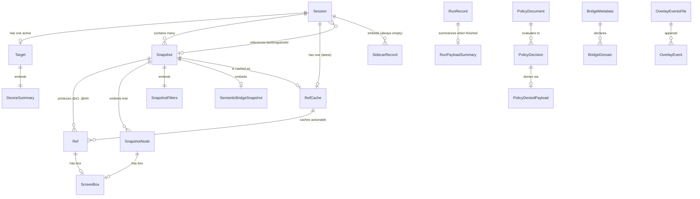

# expo98 — Core Domain Entities (Rewrite Model)

_Backbone: `analysis/expo98/DATA_OBJECTS.md`. Field types cross-checked against `legacy/expo98/src/**/domain.ts` (cited inline). Target shape: Effect Schema / tagged structs._

expo98 has **no database**. Durable state is JSON files under a per-invocation **state root** (default `<cwd>/.scratch/expo98`). One exception: `BridgeMetadata` lives in the **project** under `<projectRoot>/.expo98/`, not the state root.

---

## 1. Entity list

### Persisted entities (state root)

| Entity                                                   | Responsibility (one line)                                                                           | Persistence                           | Path                                               | Key fields                                                                                                                                                                                                                                                                                   | Owned/contained by                                                |
| -------------------------------------------------------- | --------------------------------------------------------------------------------------------------- | ------------------------------------- | -------------------------------------------------- | -------------------------------------------------------------------------------------------------------------------------------------------------------------------------------------------------------------------------------------------------------------------------------------------- | ----------------------------------------------------------------- |
| **Session** (`SessionRecord`)                            | Root of an evidence run; owns an artifact namespace and tracks the active target + last snapshot.   | on disk                               | `sessions/<sessionId>/session.json`                | `schemaVersion:1`, `sessionId`, `name` (≤48), `artifactDir`, `createdAt/updatedAt`, `closedAt?`, `activeTargetId: string\|null`, `lastSnapshotId: string\|null`, `sidecars: SidecarRecord[]`                                                                                                 | — (aggregate root)                                                |
| **Target** (`TargetRecord`)                              | The selected device/app/Metro tuple a session acts against; recomputed `stale` flag on rediscovery. | on disk                               | `sessions/<sessionId>/target.json`                 | `targetId` (`platform:device.id:appId:metroPort`), `platform`, `device: DeviceSummary`, `app{bundleId,processName,running}`, `metro{port,status,targetId,title,appId,debuggerUrl}`, `selected`, `stale`                                                                                      | Session (1 active per session)                                    |
| **Snapshot** (`SnapshotResult`)                          | A single accessibility-tree capture with addressable refs + provenance.                             | on disk                               | `sessions/<sessionId>/snapshots/<snapshotId>.json` | `snapshotId` (`snapshot-<ts>-<suffix>`), `targetId`, `routeHint`, `source: string[]`, `semanticBridge?`, `generatedAt`, `filters: SnapshotFilters`, `refs: RefRecord[]`, `tree: SnapshotNode[]`, `artifacts{json,screenshot,annotatedScreenshot}`, `limitations: string[]`                   | Session (many per session)                                        |
| **RefCache** (`RefCache`)                                | Actionable subset of the latest snapshot's refs; the file `ref *` commands read.                    | on disk                               | `sessions/<sessionId>/refs.json`                   | `snapshotId`, `targetId`, `source: string[]`, `semanticBridge?`, `refs: RefRecord[]`                                                                                                                                                                                                         | Session (exactly one, mirrors `lastSnapshotId`)                   |
| **Ref** (`RefRecord`)                                    | One addressable UI element `@e1..@eN` with role/label/box/actions and a validity flag.              | on disk (inside Snapshot + RefCache)  | (embedded)                                         | `ref:"@eN"`, `snapshotId`, `targetId`, `stale`, `role`, `label`, `text`, `placeholder`, `testID`, `nativeID`, `component`, `box: ScreenBox\|null`, `actions: string[]`, `disabled?`, `raw?`                                                                                                  | Snapshot (and copied into RefCache)                               |
| **RunRecord** (`RunningRunRecord` → `FinishedRunRecord`) | Audit log of one CLI invocation: command, redacted args, status, sanitized error.                   | on disk                               | `<stateDir>/<runId>.json`                          | `schemaVersion:1`, `runId` (`<ts>-<suffix>`), `cli{name,version}`, `command`, `args` (redacted), `root`, `stateDir`, `startedAt`, `finishedAt: string\|null`, `status:"running"\|"completed"\|"failed"`, `exitCode: number\|null`, `summary: RunPayloadSummary\|null`, `error: string\|null` | — (own aggregate; keyed under state dir, **not** under a session) |
| **BridgeMetadata** (`BridgeMetadata`)                    | Marker of the installed in-app devtools bridge, with the domains it exposes.                        | on disk (**project**, not state root) | `<projectRoot>/.expo98/bridge.json`                | `schemaVersion:1`, `bridgeVersion:"1.0.0"`, `developmentOnly:true`, `generatedBy:"expo98"`, `domains: string[]` (`navigation,network,storage,controls,performance,snapshot`)                                                                                                                 | — (project-scoped; own aggregate)                                 |
| **OverlayEventsFile** (`OverlayEventsFile`)              | Append log of in-app review overlay events for a review workflow.                                   | on disk (overlay dir)                 | `<overlayDir>/events.json`                         | `version:1`, `title`, `createdAt`, `updatedAt?`, `events: any[]`                                                                                                                                                                                                                             | — (own small aggregate, overlay-dir scoped)                       |

### Embedded value objects (persisted inside a parent, no independent identity)

| Value object                        | Lives inside                                           | Shape                                                                                                                                                                  |
| ----------------------------------- | ------------------------------------------------------ | ---------------------------------------------------------------------------------------------------------------------------------------------------------------------- |
| **SidecarRecord** / `SidecarStatus` | Session.`sidecars`                                     | `{name, pid:number\|null, port:number\|null, status:"running"\|"stale"\|"stopped"\|"unknown"}` — declared but never populated (`sidecars` is always `[]` in practice). |
| **DeviceSummary**                   | Target.`device`                                        | `{id, name:string\|null, state:"booted"\|"shutdown"\|"connected"\|"unknown"}`                                                                                          |
| **SnapshotNode**                    | Snapshot.`tree`                                        | flattened display node `{ref, role, label, text, testID, source, box, actions}` (tree is a flat array, not nested).                                                    |
| **SnapshotFilters**                 | Snapshot.`filters`                                     | `{interactiveOnly, compact, depth:number\|null (1..100), includeSource, includeBounds}`                                                                                |
| **SemanticBridgeSnapshot**          | Snapshot.`semanticBridge?`, RefCache.`semanticBridge?` | bridge route hints + `refs: Partial<RefRecord>[]` + `limitations`.                                                                                                     |
| **ScreenBox / RefBox**              | Ref.`box`, SnapshotNode.`box`                          | `{x, y, width, height}`                                                                                                                                                |
| **RunPayloadSummary**               | RunRecord.`summary`                                    | `{keys:string[] (first 40), available?, routeCount?, eventCount?}`                                                                                                     |

### In-memory entities (not persisted — inputs / decisions / result envelopes)

| Entity                       | Responsibility                                                                              | Persistence                                                  | Key fields                                                                                                                       | Related to                                             |
| ---------------------------- | ------------------------------------------------------------------------------------------- | ------------------------------------------------------------ | -------------------------------------------------------------------------------------------------------------------------------- | ------------------------------------------------------ |
| **PolicyDocument**           | User-supplied `--action-policy` file describing allowed/denied actions.                     | in-memory (input; file is user-owned, not written by expo98) | `allow?: string[]`, `actions?: Record<string, "allow"\|"deny"\|boolean>`                                                         | input to PolicyDecision                                |
| **PolicyDecision**           | Per-action verdict computed from policy + defaults (`read:allow, write:deny, device:deny`). | in-memory                                                    | `{checked, allowed, reason, source?, policy?}`                                                                                   | derived from PolicyDocument; emits PolicyDeniedPayload |
| **PolicyDeniedPayload**      | Canonical fail-closed envelope when an action is denied.                                    | in-memory                                                    | `{available:false, domain, action, source:"policy", evidenceSource:"policy", code:"policy-denied", denied:true, reason, policy}` | produced from a deny PolicyDecision                    |
| **CliGlobals**               | Parsed global flags for one invocation (drives state root, redaction, output limits).       | in-memory                                                    | `{json, plain, root?, stateDir?, actionPolicy?, maxOutput?, allowRuntimeEval?, confirmActions?, record?, quiet?}`                | seeds RunRecord + Session/Target/Snapshot ops          |
| **Command result envelopes** | Per-command in-memory payloads passed through redaction/truncation.                         | in-memory                                                    | see below                                                                                                                        | each wraps domain reads of the persisted entities      |

#### Major command result envelopes (in-memory, redacted at the boundary)

| Envelope                                                                                  | Command area                         | Notes                                                                              |
| ----------------------------------------------------------------------------------------- | ------------------------------------ | ---------------------------------------------------------------------------------- |
| `TargetCurrentResult` / `TargetListResult` / `TargetUnavailableResult`                    | target-management                    | read views over TargetRecord; `available:false`+`reason` convention.               |
| `NetworkEvidencePayload` (+ `NetworkRequest`, `NetworkTransport`, `NetworkCaptureTiming`) | network-evidence                     | `{available, transport, requests, waterfall, duplicates, har?}`; headers redacted. |
| `WaitEvaluation` (+ `WaitPredicate`, `WaitTiming`)                                        | ref-actions-wait                     | `{matched, final, payload}`; timeout clamp 0..60000.                               |
| `MetroTargetsResult` / `MetroStatusPayload` (+ `MetroTarget`, `TargetNormalizationError`) | metro-probes                         | feeds target discovery.                                                            |
| `PerfReport` (+ `PerfFinding`, `PerfMetric`, `PerfNativeSummary`, ...)                    | perf-evidence                        | `{available, confidence, metrics, findings, native?, limitations}`.                |
| `GesturePlan` / `InteractionPayload`                                                      | interaction-actions                  | `{gesture, start, end, durationMs, repeat, intervalMs, maxEvents}`.                |
| `crashCheck` (+ `crashReports[]`)                                                         | app-lifecycle-actions                | `{action, bundleId, processName, since, waitedMs, reportCount}`.                   |
| `DomainUnavailable` / `BridgeRuntimeTransport` / `BridgeDomainCommandInput`               | bridge-domain-actions                | `available:false`+`code` family for runtime bridge calls.                          |
| `BridgeInstallStatus` / `BridgeInstallPlan` / `BridgeIssue`                               | bridge-command-adapter               | describe/plan install of BridgeMetadata + source.                                  |
| `RouteEntry` / `ExpoRouteContext`; `DependencyInfo` / `CompatibilityClassification`       | router-sitemap / project-info-doctor | static analysis results.                                                           |
| `LiveBacklogRow` / `LiveBacklogSummary` / `BacklogRowResult`                              | live-backlog                         | classification of backlog rows; reuses `RunPayloadSummary`-style keys.             |

---

## 2. Entity-relationship diagram

Notes on cardinality choices:

- `Session ||--o| Target` — at most one **active** target (`activeTargetId`); discovery may list many `TargetRecord`s but only one is persisted/selected per session.
- `Session ||--o{ Snapshot` — zero-or-many snapshots accumulate under `sessions/<id>/snapshots/`.
- `Session }o--o| Snapshot` (lastSnapshotId) — a soft pointer, nullable; distinct from containment, modeled separately so the rewrite treats it as a reference, not ownership.
- `Snapshot ||--o| RefCache` — each snapshot can be materialized as the single `refs.json`; the cache is overwritten, so only the latest snapshot's refs survive there.
- `RunRecord` has **no** edge to Session — it is keyed at `<stateDir>/<runId>.json`, independent of sessions.
- `BridgeMetadata` has **no** edge to the state-root entities — it is project-scoped.
- `BridgeDomain`, `OverlayEvent`, `SidecarRecord` are shown as the multiplicity targets of their string/array fields for clarity (they are primitive/loosely-typed in legacy: `domains: string[]`, `events: any[]`).

---

## 3. Aggregate boundaries (for the rewrite)

Four independent consistency boundaries. Cross-aggregate links are by **ID reference only**, never shared mutable state.

1. **Session aggregate** — root: **Session**.
   - Contains: its **Target** (active), all its **Snapshots**, the **RefCache**, and the embedded value objects (SidecarRecord, DeviceSummary, SnapshotNode, SnapshotFilters, Ref, ScreenBox, SemanticBridgeSnapshot).
   - Invariants to enforce transactionally: `activeTargetId` must point at the persisted `target.json`; `lastSnapshotId` must point at an existing snapshot file; `refs.json` must mirror the snapshot named by `lastSnapshotId`. These three pointers are exactly the consistency rules that make Session the aggregate root.
   - All files live under `sessions/<sessionId>/`, so the directory **is** the aggregate's storage boundary.

2. **RunRecord aggregate** — root: **RunRecord** (with embedded RunPayloadSummary).
   - Lives at `<stateDir>/<runId>.json`, sibling to (not inside) sessions. Lifecycle is `running → completed|failed`, owned entirely by the dispatch layer. It only **references** a session/target by the values captured in `args`/`command`; it never mutates them. Keep it a separate aggregate so audit writes never contend with session state.

3. **BridgeMetadata aggregate** — root: **BridgeMetadata** (with BridgeInstallStatus/Plan/Issue as transient install-time views).
   - Project-scoped at `<projectRoot>/.expo98/bridge.json`, deliberately outside the state root. Different lifecycle (install/remove a developer dependency), different filesystem location, different owner (the app repo). Must not be folded into the state-root model.

4. **OverlayEventsFile aggregate** — root: **OverlayEventsFile**.
   - Overlay-dir scoped (`<overlayDir>/events.json`), an append-only event log for the review workflow. Small and self-contained; keep separate.

**Non-persisted, no aggregate:** PolicyDocument / PolicyDecision / PolicyDeniedPayload and all command result envelopes are pure values computed per invocation. In Effect-TS model them as `Schema`-validated structs returned by services; they cross aggregate boundaries as read-only DTOs and are redacted/truncated at the `tool-json-envelope` boundary before output.

---

## Confidence & Gaps

- **High confidence** — all persisted shapes and paths verified directly against `domain.ts`/`index.ts`/`events.ts` source (cited in DATA_OBJECTS.md and re-read here). The three Session pointer invariants are inferred from field semantics + RULE references, consistent across all three `domain.ts` copies.
- **Schema drift to resolve:** `SessionRecord` is redeclared three times — canonical at `session-run-records/.../domain.ts:28-39` (has `closedAt?`, `sidecars: SidecarRecord[]`), with looser copies at `target-management/.../domain.ts:40-50` and `snapshot-evidence/.../domain.ts:19-29` (`sidecars: unknown[]`, no `closedAt`). `TargetRecord`/`DeviceSummary` similarly loosened in `snapshot-evidence`. Unify on the strict version in the rewrite.
- **`semanticBridge` typing:** declared `SemanticBridgeSnapshot` but stored as `unknown` on both `SnapshotResult` and `RefCache` (`snapshot-evidence/.../domain.ts:121,138`). Tighten in the rewrite.
- **Loosely-typed collections:** `OverlayEventsFile.events: any[]` and `BridgeMetadata.domains: string[]` have no element schema — the `OverlayEvent` / `BridgeDomain` nodes in the diagram are placeholders for whatever the rewrite chooses to model.
- **Could not determine from these files:** the concrete element schema of overlay `events[]` (would need the review-overlay event producers); whether `RunRecord` ever cross-references a `sessionId` field explicitly (it captures `args`/`command` only — confirm with an SME on whether run→session linkage is desired in the rewrite).
- **SME questions:** (1) Should `sidecars` be dropped entirely given it is never populated (RULE-033)? (2) Should the rewrite add an explicit `sessionId` foreign key onto RunRecord for queryability, or keep them decoupled as today?
